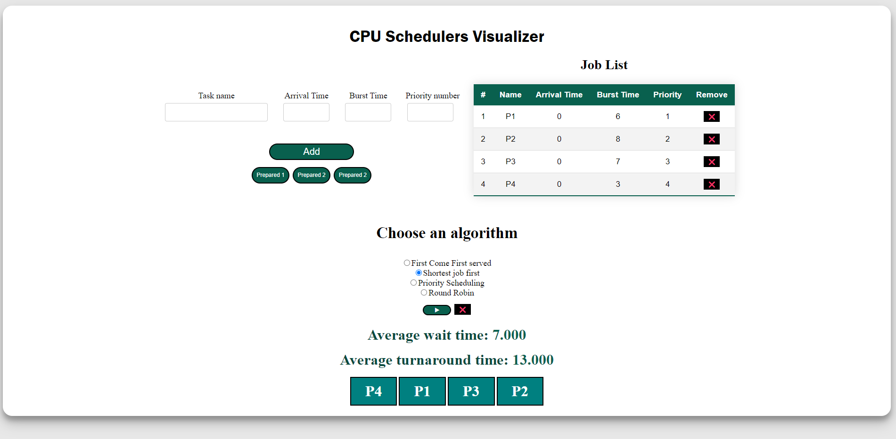

# CPU-Schedulers in Javascript

<a href="https://sal7one.github.io/CPU-Schedulers/"> Try it here </a>

•	First-Come, First-Served Scheduling- The processor services the processes in the sequence they arrive in the ready queue.

•	Shortest-Job-First Scheduling- The processor services the shortest process in the ready queue first.

•	Priority Scheduling - The processor services the process with high priority in the ready queue first.

•	Round-Robin Scheduling - This is like the first-in-first-out scheduling. As the process arriving first in the ready queue will be serviced first.
But the processor pre-empts the process after a time quantum. And placed back in the ready queue, the next process in the ready queue is given a chance to execute.

